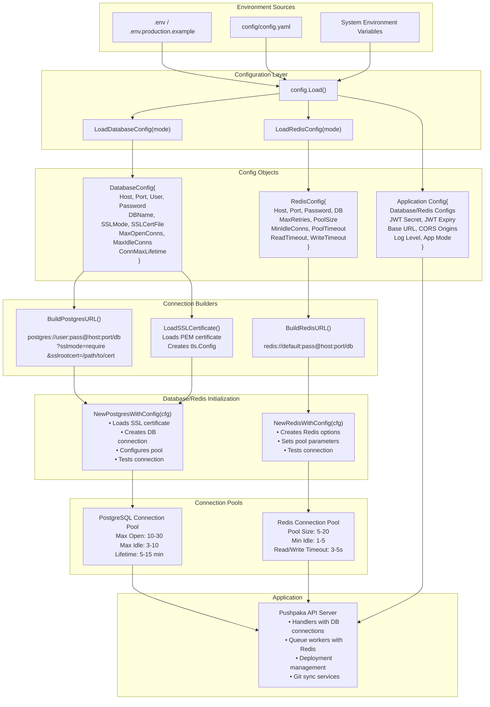

## Configuration Flow Diagram

This diagram shows how environment variables flow through Pushpaka's configuration system:

### Key Steps:

1. **Input Sources**
   - `.env` files for environment variables
   - `config.yaml` for centralized configuration
   - System environment variables (highest priority)

2. **Configuration Loading**
   - `config.Load()` reads from all sources
   - Creates `DatabaseConfig` and `RedisConfig` structures
   - Applies mode-specific defaults (dev/staging/prod)

3. **URL Building**
   - `BuildPostgresURL()` constructs PostgreSQL DSN with SSL parameters
   - `BuildRedisURL()` constructs Redis connection URL
   - SSL certificates loaded if configured

4. **Connection Initialization**
   - `NewPostgresWithConfig()` creates database connection pool
   - `NewRedisWithConfig()` creates Redis connection pool with custom settings
   - Both test connection before returning

5. **Running Application**
   - App uses initialized pools for all operations
   - Deployment management queries database
   - Queue workers use Redis for job distribution

## Environment Variable Priority (Highest to Lowest)

```
System Environment Variables (cli/shell exports)
    ↓
.env file (local override)
    ↓
.env.production.example defaults (documentation)
    ↓
Hardcoded defaults in config.go (fallback)
```

## Mode-Based Defaults

### Development Mode
- Database: SQLite (no network)
- Redis: Optional (in-process queue used)
- SSL: Disabled
- Pool Size: Small (3-5 idle, 10-5 connections)
- Log Level: Debug

### Staging Mode
- Database: PostgreSQL
- Redis: Enabled
- SSL: Prefer (SSL if available)
- Pool Size: Medium (5 idle, 20 connections)
- Log Level: Info

### Production Mode
- Database: PostgreSQL with SSL required
- Redis: Enabled with authentication
- SSL: Enforce (require or verify-full)
- Pool Size: Large (10 idle, 30 connections)
- Log Level: Warning only
